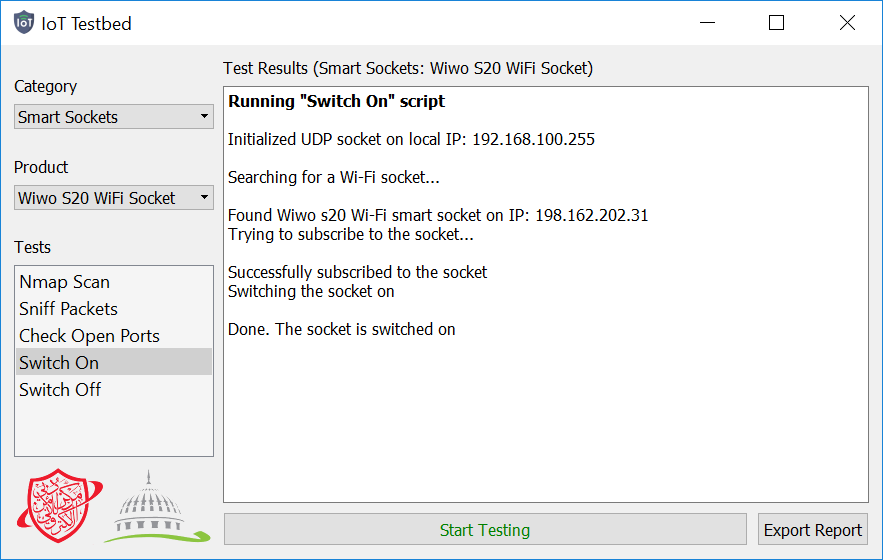

## IoT Security Testbed

A testing tool that's meant to checks the security of some IoT devices used in the UAE, this program was a part of a research I worked on.
It works by running scripts against IoT devices to try and hack them then show a report about the results, it's written in Python 3 using PyQt5.

### ScreenShot


### Demo

Download a compiled "exe" demo file from [Releases](../../releases).
Or download the source code and follow the steps below to run it.

### Setup
1. Install all packages required for this application using this command:
    ```bash
    pip install -r requirements.txt
    ```

2. After applying changes to the application layout (using QT Designer), run this command:
    ```bash
    pyuic5 iottestbed.ui -o layout.py
    ```

### Deployment
- To run the application directly through Python, simply use this command:
    ```bash
    python main.py
    ```

- To convert the application into an "exe" executable, use this command (find .exe in dist/ folder): 
    ```bash
    pyinstaller --clean -F -w main.py -i iot.ico --add-data="iot.ico;." --add-data="sponsors.png;." -n iottestbed
    ```

### References
- [Python](https://www.python.org)
- [PyQt](https://riverbankcomputing.com/software/pyqt/intro)
